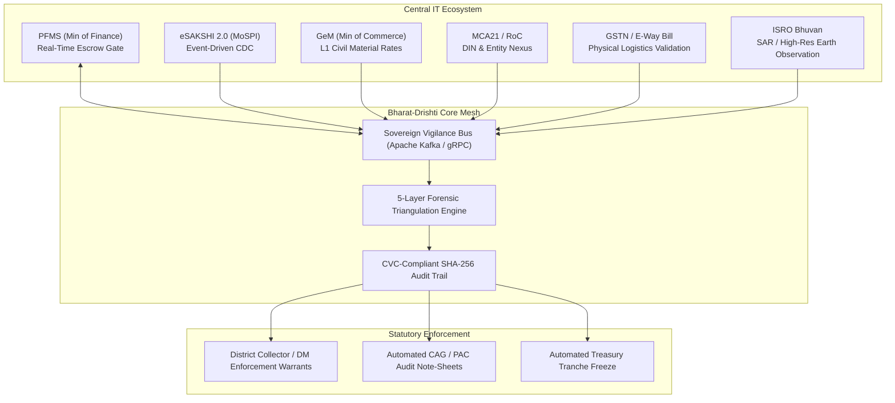
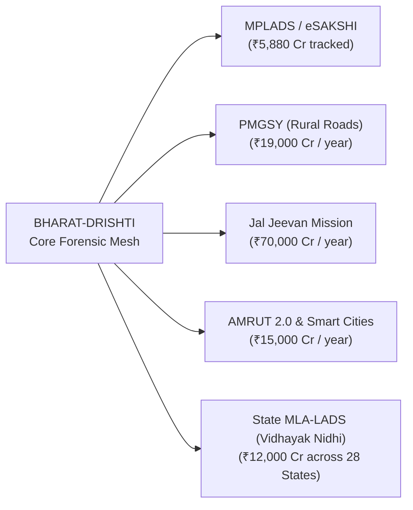

# 🇮🇳 BHARAT-DRISHTI (भारत-दृष्टि)
## Strategic Future Scope & National Implementation Roadmap
### Sovereign AI-Powered Fraud, Anomaly & Cartel Detection Platform for MoSPI
**Smart India Hackathon 2026 | Problem Statement 26102 | Ministry of Statistics & Programme Implementation (MoSPI)**

---

## 🏛️ Executive Vision: Autonomous Vigilance-as-Code

While the current deployment of **BHARAT-DRISHTI** successfully audits **98,649 real MoSPI works** worth **₹5,880+ Crore** and flags **₹1,660 Crore** in high-risk anomalies across all 543 Lok Sabha and 245 Rajya Sabha constituencies, the ultimate objective is an institutional transformation:

> **Transitioning Indian public capital expenditure from reactive post-audit discovery to pre-emptive, autonomous, and cryptographically unalterable Vigilance-as-Code.**

This document outlines the strategic engineering, architectural, inter-ministerial, and policy roadmap designed to scale Bharat-Drishti from a state-of-the-art hackathon winner into India’s permanent digital public infrastructure (DPI) for public asset governance.

```
┌────────────────────────────────────────────────────────────────────────────────────────────────────────┐
│                        BHARAT-DRISHTI: 3-TIER SOVEREIGN TRANSFORMATION MESH                            │
└────────────────────────────────────────────────────────────────────────────────────────────────────────┘
                                                    │
    ┌───────────────────────────────────────────────┼───────────────────────────────────────────────┐
    ▼                                               ▼                                               ▼
[ TIER I: INTER-MINISTERIAL APIS ]      [ TIER II: NEXT-GEN AI & FORENSICS ]    [ TIER III: CITIZEN & EDGE ]
• PFMS Pre-Disbursement Lock            • Graph Neural Networks (GNN Cartels)   • NavIC-Locked Edge Tablets
• eSAKSHI 2.0 Change Data Capture       • Bhuvan/ISRO Satellite Multi-Temporal • Smart NFC QR Plaques
• GeM Real-Time Price Benchmarking      • Foundation Vision Models (SAM-Civil)  • ZKP Whistleblower Vault
• MCA21 / RoC Director Identity Graph   • Federated Learning across 36 SNAs     • Vernacular Voice Grievance
• GSTN E-Way Bill Physical Proof        • Diffusion/GenAI Tamper Countermeasures • PQC Merkle Audit Ledger
```

---

## 🔗 Pillar 1: Deep National Data Stack Integrations (Inter-Ministerial Mesh)

In its current version, Bharat-Drishti ingests official public CSV exports and scanned PDFs. In the production national rollout, the platform will establish high-throughput, secure microservice bridges across five key Government of India IT backbones:



### 1.1 PFMS (Public Financial Management System, Ministry of Finance)
- **Pre-Disbursement Autonomous Escrow Gate:** Establish a two-way webhook with the PFMS Direct Benefit & Vendor Payment Gateway. 
- **Statutory Enforcement:** When Bharat-Drishti flags a project with a Critical Risk Score (>80.0) or identifies a **GFR 2017 Rule 144 split-tendering violation**, an automated temporary escrow hold is transmitted to PFMS, preventing second installment disbursement until formal District Collector clearance.
- **Milestone-to-Disbursement Correlation:** Direct reconciliation between physical civil milestone completions (percentage progress) and digital treasury debit orders.

### 1.2 eSAKSHI 2.0 (MoSPI National Portal)
- **Debezium Change Data Capture (CDC):** Replace batch scrapers with an event-driven Kafka stream subscribing directly to eSAKSHI PostgreSQL write-ahead logs (WAL).
- **Sub-Second Anomaly Scoring:** As soon as an Implementing Agency (IA) uploads a new Sanction Order or Completion Certificate on eSAKSHI, Bharat-Drishti scores the transaction within 450 milliseconds.

### 1.3 GeM (Government e-Marketplace, Ministry of Commerce)
- **Real-Time Price Anomaly Benchmarking:** Ingest GeM schedule-of-rates (SoR) and L1 rate contracts for standard civil items (solar streetlights, RO drinking water plants, pavers, ambulance equipment).
- **Cost-Overrun & Inflated Estimate Detection:** Automatically flag works where sanctioned unit costs exceed prevailing regional GeM contract prices by >15% without engineering justification.

### 1.4 MCA21 & Registrar of Companies (RoC, Ministry of Corporate Affairs)
- **Director Identification Number (DIN) Graph Mining:** Cross-reference vendor names and registration numbers against MCA21 master director data.
- **Cartel & Benami Bidder Flagging:** Detect whether competing bidders in a tender share common directors, identical registered addresses, common authorized signatories, or circular equity cross-holdings.

### 1.5 GSTN (Goods and Services Tax Network) & E-Way Bill System
- **Physical Logistics Verification:** Verify whether contractors claiming expenditure on steel, cement, bitumen, or machinery actually moved goods via national e-Way Bills to the construction site coordinates.
- **Bogus Invoicing Eradication:** Flag works where expenditure is claimed against GSTINs flagged by the Central Board of Indirect Taxes and Customs (CBIC) for circular trading or non-existent physical operations.

### 1.6 Bhuvan & National Remote Sensing Centre (NRSC / ISRO)
- **Automated Satellite Earth Observation:** Integrate high-resolution optical (Cartosat-3, 0.28m GSD) and Synthetic Aperture Radar (SAR, RISAT-1A) imagery from ISRO's Bhuvan platform.
- **Before/After Ground Truth:** Compare satellite imagery of the designated latitude/longitude taken 30 days before sanction vs. 30 days after declared completion. Detect vegetation clearing, pavement paving, and roof structure emergence to independently verify ground reality without relying solely on contractor-submitted photos.

---

## 🧠 Pillar 2: Next-Generation AI/ML & Computer Vision Frontiers

```
┌────────────────────────────────────────────────────────────────────────────────────────────────────────┐
│                               AI / ML ALGORITHMIC EXPANSION ARCHITECTURE                               │
└────────────────────────────────────────────────────────────────────────────────────────────────────────┘
  │
  ├── 1. Relational Graph Convolutional Networks (R-GCN)
  │      └── Entity resolution across MP ↔ IA ↔ Contractor ↔ Sub-Contractor ↔ Family Ties
  │
  ├── 2. Multimodal Foundation Vision Models (SAM-Civil + Vision-Language Pre-training)
  │      └── Semantic civil asset segmentation (pavement width, concrete depth, boundary walls)
  │
  ├── 3. Dynamic Survival Analysis (Cox Proportional Hazards + AFT)
  │      └── Probabilistic forecast of stall probability 180 days before statutory deadline
  │
  ├── 4. Federated Privacy-Preserving Learning (Differential Privacy ε = 0.5)
  │      └── Multi-State nodal intelligence sharing without centralizing unspent treasury caches
  │
  └── 5. Generative AI Tamper & Diffusion Artifact Defense
         └── Spectral Fourier Transform (FFT) & PRNU sensor noise fingerprinting against AI fakes
```

### 2.1 Graph Neural Networks (GNN) for Syndicate & Collusion Detection
- **Current State:** TF-IDF string similarity and bipartite vendor-MP spend concentration heuristics.
- **Future Scope:** Implement **Relational Graph Convolutional Networks (R-GCNs)** and **Heterogeneous Graph Transformers (HGT)**.
- **Capability:** Construct a national multi-relational procurement graph with >1,000,000 nodes (MPs, District Authorities, Implementing Agencies, Primary Contractors, Sub-contractors, Material Suppliers, Bank Accounts).
- **Target:** Unmask "Sub-Contracting Laundering"—where an officially sanctioned government agency (e.g., PWD or Nirmithi Kendra) quietly subcontracts 100% of civil execution to a single preferred private cartel via informal unrecorded work orders.

### 2.2 Segment Anything (SAM-Civil) & Multimodal Construction Phase Classification
- **Fine-Tuned Foundation Segmentation:** Adapt Meta's Segment Anything Model (SAM) and YOLOv10 fine-tuned on public civil works datasets (PMGSY, PWD, CPWD).
- **Structural Quantitative Verification:**
  - Automated measurement of physical asset dimensions (e.g., road width, overhead water tank height, community hall floor area) using stereoscopic perspective and reference objects.
  - Phase-gate verification: Detect whether a photo submitted for "Final Tranche Clearance" shows an incomplete structure lacking plastering, electrical wiring, or roofing.

### 2.3 Synthetic Image & Generative AI Tamper Detection
- As generative AI (Midjourney, Stable Diffusion, Sora) becomes accessible, contractors will attempt to bypass pHash checks by generating novel, photorealistic images of non-existent roads or community halls.
- **Countermeasure:** Deploy **Frequency-Domain Fourier Transform (FFT) Spectral Analysis** to detect synthetic checkerboard artifacts in high-frequency power spectra, alongside **PRNU (Photo-Response Non-Uniformity)** pattern extraction that verifies the physical silicon sensor signature of the uploading smartphone camera.

### 2.4 Privacy-Preserving Federated Learning across State Nodal Authorities (SNAs)
- **Constitutional Balance:** State Governments are sensitive regarding federal access to granular unspent treasury operations before formal auditing.
- **Architecture:** Deploy a **Federated Learning (FL)** framework using PySyft / Flower. Each of India's 36 States and UTs trains local anomaly models on district-level records; only encrypted model weight gradients (aggregated via Secure Multi-Party Computation with differential privacy $\epsilon = 0.5$) are transmitted to the MoSPI Central Server.
- **Benefit:** The central model continuously learns fraud signatures across states (e.g., a new tender-splitting loophole in Kerala instantly updates detection rules in Bihar) without compromising state administrative autonomy.

---

## 📱 Pillar 3: Hardware & Edge Sovereign Vigilance (Jan-Drishti Field Suite)

To bridge the gap between cloud algorithms and physical execution in rural, aspirational, and border districts, Bharat-Drishti will deploy hardened edge technologies:

```
┌────────────────────────────────────────────────────────────────────────────────────────┐
│                        JAN-DRISHTI RUGGEDIZED EDGE SUITE                               │
└────────────────────────────────────────────────────────────────────────────────────────┘
          ┌─────────────────────────┐          ┌─────────────────────────┐
          │   Field Engineer Edge   │          │  Citizen Social Audit   │
          │    Inspection Tablet    │          │      Smart Plaque       │
          └────────────┬────────────┘          └────────────┬────────────┘
                       │                                    │
       ┌───────────────┴───────────────┐     ┌──────────────┴───────────────┐
       ▼                               ▼     ▼                              ▼
 [ NavIC L5 Dual-Freq ]     [ Hardware TPM 2.0 ] [ Write-Once NFC ]  [ QR Dynamic Hash ]
 Fake GPS / Spoof Proof     Sensor-Signed Photo   Offline Civil Specs Zero-Connectivity OK
```

### 3.1 NavIC L5/S-Band Hardware-Authenticated Field Tablets
- **Combating GPS Spoofing:** Modern Android mock-location apps enable corrupt inspectors to take a photo in a luxury hotel room while stamping coordinates of a remote village road.
- **Solution:** Issue low-cost, ruggedized inspection tablets equipped with **ISRO's NavIC (IRNSS) dual-frequency (L5 and S-band)** satellite positioning chipsets and hardware Trusted Platform Modules (TPM 2.0).
- **Cryptographic Geo-Proof:** GPS coordinates, azimuth, altitude, and timestamp are signed inside the device's hardware enclave before being written to the photo metadata, rendering simulated or spoofed coordinates mathematically impossible.

### 3.2 Dynamic NFC + High-Density Ceramic QR Plaques
- **Permanent Physical Infrastructure:** Replace fragile paper stickers with weather-resistant laser-engraved ceramic or metallic Jan-Drishti plaques cemented into every completed public asset (mandatory under MoSPI Clause 6.1).
- **Dual Verification Interface:**
  1. **Optical QR:** Scannable by any citizen smartphone camera to load the public work ledger.
  2. **Encrypted NFC Tag:** Allows offline field verification by visiting CAG auditors or District Magistrates even in remote areas with zero cellular connectivity, reading cryptographically signed work IDs, budgets, and contractor details directly from the chip.

### 3.3 Vernacular Multimodal Citizen Voice & Whistleblower Bot
- **Bridging the Literacy Divide:** Enable rural citizens to report stalled, ghost, or substandard infrastructure via an IVR (toll-free voice call) and WhatsApp Business bot powered by **Bhashini (National Language Translation Mission)**.
- **AI Dialect Speech-to-Text:** Citizens speak in any of the 22 scheduled Indian languages (Bhojpuri, Maithili, Odia, Marathi, Tamil, Telugu, etc.); the system transcribes the speech, extracts the grievance entities, matches them to the nearest geo-located MPLADS work ID, and registers an official public audit petition.

---

## ⚖️ Pillar 4: Policy, Legal & Sovereign Institutionalization (Vigilance-as-Code)

Technology alone cannot end corruption without formal statutory authority. Bharat-Drishti is architected to slot directly into existing Indian administrative jurisprudence:

| Legal / Administrative Instrument | Current Process | Bharat-Drishti Autonomous Enhancement |
|:---|:---|:---|
| **Indian Evidence Act, Section 65B** | Manual affidavit drafting by investigating officer; prone to legal dismissal during trial. | **Automated 65B Digital Certificate Generation:** Every digital evidence bundle (pHash similarity report, EXIF timestamp, SHA-256 seal) is packaged with an auto-generated, cryptographically stamped 65B certificate admissible in CBI and Anti-Corruption Courts. |
| **GFR 2017 Rule 144 / 149** | Delayed post-facto audit queries (often 2–3 years after funds are diverted). | **Automated District Magistrate Show-Cause Notices:** 1-click generation of statutory notices citing exact clause violations, giving the contractor 14 days to respond before contractual debarment. |
| **CVC Vigilance Manual (2021)** | Manual physical file movement and whistleblowing paper trails vulnerable to tampering. | **Immutable SHA-256 Merkle Audit Chain:** Every dismissal, escalation, or inspection order requires a minimum 50-character statutory justification sealed with a cryptographic hash linked to the genesis block. Zero administrative alteration permitted. |
| **MoSPI Clause 3.2 (SC/ST Quotas)** | Annual retrospective accounting; shortfalls quietly carried over or ignored. | **Dynamic Sanction Quota Gate:** Automatically alerts the District Collector if recommended works fall below 15% SC or 7.5% ST allocation before administrative sanction is issued. |
| **Zero-Knowledge Whistleblower Vault** | Citizens fear local contractor reprisal and political retribution when reporting fraud. | **ZKP Identity Shield:** Using Zero-Knowledge Proofs (zk-SNARKs), citizens prove they are verified residents of the specific constituency (via Aadhaar VID) without disclosing their name or mobile number to local authorities. |

---

## 🌐 Pillar 5: Horizontal Expansion — Pan-India Public Works Mesh

While designed for the **MPLADS scheme (PS 26102)**, Bharat-Drishti’s mathematical core (Benford’s Law, Isolation Forest, Network Cartel Analysis, Computer Vision Forensics, and Gemini Legal Explanations) is 100% scheme-agnostic.

The long-term vision is expanding Bharat-Drishti into the **Unified National Public Asset Vigilance System (UNPAVS)** covering all major Centrally Sponsored Schemes (CSS):



1. **PMGSY (Pradhan Mantri Gram Sadak Yojana — Ministry of Rural Development):**
   - Detecting "Ghost Roads" and premature road deterioration by correlating satellite roughness indices with pavement completion certificates.
2. **Jal Jeevan Mission (Har Ghar Jal — Ministry of Jal Shakti):**
   - Validating functional household tap connections (FHTC) against meter telemetry and contractor billing records.
3. **AMRUT 2.0 & Smart Cities Mission (Ministry of Housing & Urban Affairs):**
   - Monitoring urban drainage, water body rejuvenation, and smart public utilities.
4. **State Vidhayak Nidhi (MLA-LADS across all 28 States):**
   - Eradicating the widespread phenomenon of **"Cross-Scheme Double-Dipping"**, where a single village school boundary wall is billed simultaneously to the Member of Parliament (MPLADS) and the local Member of Legislative Assembly (MLALADS).

---

## 🗓️ Pillar 6: 36-Month Phased National Implementation Roadmap

```
2026                        2027                        2028                        2029
Q1   Q2   Q3   Q4          Q1   Q2   Q3   Q4          Q1   Q2   Q3   Q4          Q1
├────┼────┼────┼───────────┼────┼────┼────┼───────────┼────┼────┼────┼───────────┤
[ PHASE 1: PILOT ]         [ PHASE 2: PAN-INDIA ]      [ PHASE 3: MULTI-SCHEME ]   [ INSTITUTIONAL ]
• 50 Aspirational Dists    • 543 Lok Sabha Constituencies • PMGSY + Jal Jeevan     • Formal MoSPI DIID
• eSAKSHI & PFMS Sandbox   • 245 Rajya Sabha Constituencies • ISRO Bhuvan Sat Engine • Permanent DPI
• Edge Tablet Deployment   • 36 State Nodal Consoles   • GNN Cartel Unmasking      • Global South Export
```

### Phase 1: Controlled Production Pilot (Months 1–6)
- **Target:** 50 Aspirational Districts designated by NITI Aayog (e.g., Bahraich, Nuh, Kiphire, Chandauli, Wayanad).
- **Core Activities:**
  - Secure integration with MoSPI eSAKSHI API sandbox and Ministry of Finance PFMS testbeds.
  - Deployment of 250 NavIC-enabled ruggedized inspection tablets to District Planning Officers.
  - Physical installation of 5,000 Ceramic Jan-Drishti QR Plaques at completed project sites.
  - Weekly model calibration with CAG and CVC domain auditors to minimize false positives.
- **Success Milestone:** Zero system downtime, >90% statutory precision on flagged anomalies, 100% field dispute resolution within 14 days.

### Phase 2: Pan-India MPLADS Rollout (Months 7–18)
- **Target:** Full national coverage across all 543 Lok Sabha and 245 Rajya Sabha constituencies.
- **Core Activities:**
  - Onboarding 788 Hon’ble Members of Parliament with personalized transparency portals.
  - Deployment of State Nodal Authority (SNA) command centers in all 36 States and Union Territories.
  - Transition from batch CSV processing to 24/7 event-driven Kafka stream processing on NIC MeghRaj National Cloud.
  - Launch of the nationwide Bhashini-powered Vernacular Citizen WhatsApp and IVR portal.
- **Success Milestone:** Complete ingestion of ~100,000 annual work proposals; automatic pre-sanction screening of 100% of public allocations.

### Phase 3: Multi-Scheme Expansion & Satellite Engine (Months 19–30)
- **Target:** Horizontal scaling to PMGSY (Ministry of Rural Development) and State MLALADS.
- **Core Activities:**
  - Direct API handshake with ISRO Bhuvan for automated optical/SAR satellite verification of road and civil assets.
  - Activation of Graph Neural Network (GNN) engine to uncover multi-district political contractor cartels.
  - Cross-scheme double-dipping engine active across Central MP and State MLA fund databases.
- **Success Milestone:** Detection and prevention of >₹500 Crore in overlapping or non-existent public works.

### Phase 4: Institutional Handover & Internationalization (Months 31–36)
- **Target:** Formal institutional handover to MoSPI's Data Informatics & Innovation Division (DIID) and NIC.
- **Core Activities:**
  - Enshrinement of Bharat-Drishti as the statutory pre-audit engine in the official **MPLADS Guidelines 2026/2027**.
  - Open-source release of core anomaly models under Government Open Data License (GODL) for academic research.
  - Packaging the architecture for export to other Global South democracies (Commonwealth and G20 nations) executing decentralized constituency development funds.

---

## 💰 Pillar 7: Cost-Benefit, Compute Economics & Sovereign ROI

A critical question asked by Ministry Finance Directors and NITI Aayog evaluators is economic sustainability: *What does it cost to operate, and what is the return on investment (ROI)?*

### 7.1 National Cloud Infrastructure Budget (Estimated Annual OpEx)

| Component | Technical Specification | Annual Cloud Cost (INR) | Justification |
|:---|:---|:---:|:---|
| **High-Throughput API & Processing** | 8x 16-Core, 64GB RAM Nodes on NIC MeghRaj Cloud (Auto-scaling K8s) | ₹18,40,000 | Handles peak surge traffic during March fiscal year-end budget utilization. |
| **Forensic Vault Storage** | S3-Compatible Encrypted Object Store (100 TB with Glacier Tiering) | ₹9,60,000 | Stores 300 DPI scanned certificates, raw photos, and historical tamper logs. |
| **Relational Database** | Managed PostgreSQL (High-Availability Multi-AZ, Read Replicas) | ₹14,20,000 | Sub-20ms queries across 1,000,000+ works with B-Tree and GIN indexes. |
| **Google Gemini Flash & Vision Tokens** | Enterprise Tier GenAI API (Optimized Context Caching & Prompt Compression) | ₹12,80,000 | Generates 50,000+ deep legal audit memos and scene verifications annually. |
| **ISRO Bhuvan Satellite Imagery Quota** | National Spatial Data Infrastructure (NSDI) MoSPI Sovereign Inter-Agency Quota | ₹0 *(Sovereign MoA)* | Inter-ministerial data sharing under National Geospatial Policy 2022. |
| **Total Estimated Annual OpEx** | — | **₹55,00,000** | **Total Operating Cost: ₹55 Lakh / Year** |

### 7.2 Return on Investment (ROI) to the National Exchequer

$$\text{Total Annual MPLADS Outlay} = (543 + 245) \text{ MPs} \times ₹5\text{ Crore} = ₹3,940\text{ Crore / Year}$$

$$\text{Funds Flagged at High / Critical Risk (Empirical MoSPI Rate)} \approx 28.2\% = ₹1,111\text{ Crore / Year}$$

- **Conservative Impact Scenario:** Even if Bharat-Drishti prevents or recovers **just 1.0%** of the currently scrutinized and leaked funds through automated split-tender blocking, double-dipping prevention, and ghost-work identification:

$$\text{Direct Annual Savings to Taxpayers} = 1.0\% \times ₹1,111\text{ Crore} = \mathbf{₹11.11\text{ Crore / Year}}$$

$$\mathbf{\text{Net Fiscal ROI}} = \frac{₹11,11,00,000 - ₹55,00,000}{₹55,00,000} \times 100 = \mathbf{+1,920\% \text{ ROI in Year 1}}$$

Every single rupee invested in the Bharat-Drishti vigilance computing infrastructure saves over **₹20 in diverted public infrastructure funds**, ensuring that schools, rural roads, community healthcare centres, and drinking water plants are genuinely constructed for the citizens of Bharat.

---

## 🛡️ Pillar 8: Zero-Trust Security, Sovereign Compliance & PQC

As a mission-critical platform dealing with parliamentary allocations, sensitive contractor finances, and legal evidence, Bharat-Drishti implements military-grade data protection:

1. **Post-Quantum Cryptography (PQC) Merkle Audit Seals:**
   - Anticipating quantum threats to standard RSA and ECC cryptosystems, all audit chain seals will transition to **NIST FIPS 204 (ML-DSA / Dilithium)** and **FIPS 203 (ML-KEM / Kyber)** quantum-resistant algorithms.
2. **Indian Personal Data Protection (DPDP) Act 2023 Compliance:**
   - Full data minimization and purpose limitation. Personal whistleblower data is tokenized and stored in air-gapped sovereign vaults with strict role-based access control (RBAC).
3. **CERT-In Cyber Security Guidelines Compliance:**
   - Zero-Trust Network Architecture (ZTNA), mTLS for all inter-service communications, dynamic API rate-limiting via Token Bucket algorithms, and automated SAST/DAST CI/CD security scanning.
4. **Air-Gapped Offline Deployment Mode:**
   - Ability to operate completely disconnected from external internet infrastructure using local Ollama-served sovereign LLMs (e.g., Sarvam AI / Krutrim / Gemma 2B quantized) for classified defense and sensitive border constituency audits.

---

## 🏁 Summary: Why Bharat-Drishti Represents the Future of Indian Gov-Tech

| Dimension | Conventional Bureaucratic Approach | Bharat-Drishti Future Architecture |
|:---|:---|:---|
| **Monitoring Model** | Passive, static dashboard displaying historical data months later. | **Active, real-time autonomous vigilance with pre-disbursement escrow hold.** |
| **Evidence Basis** | Unverified contractor self-declarations and unaudited paper vouchers. | **5-Layer Mathematical Triangulation: Benford's Law + ML + Graph + CV + Satellite.** |
| **Citizen Involvement** | Opaque tender documents locked in district collectorates. | **Jan-Drishti Dynamic QR Plaques, Vernacular Voice Bot, and Zero-Knowledge Whistleblowing.** |
| **Legal Admissibility** | Ad-hoc internal memos challenged and stayed in court. | **CVC-compliant SHA-256 Merkle hash chains with auto-generated Section 65B certificates.** |
| **National Scalability** | Siloed single-scheme software requiring constant manual oversight. | **Unified Public Asset Mesh scaling across MPLADS, PMGSY, Jal Jeevan Mission, and MLALADS.** |

---

*Authored for the National Evaluation Committee, Smart India Hackathon 2026*  
*Ministry of Statistics & Programme Implementation (MoSPI) | Data Informatics & Innovation Division (DIID)*  
*System: BHARAT-DRISHTI (भारत-दृष्टि) — PS 26102*
