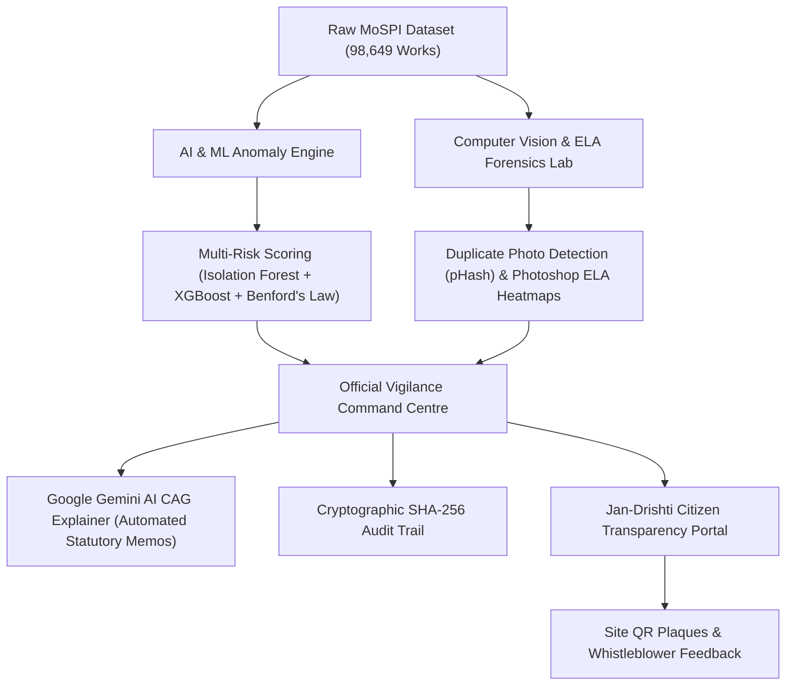

# 🇮🇳 BHARAT-DRISHTI (भारत-दृष्टि)
### National AI Vigilance, Forensic Audit & Public Accountability System for MPLADS
**Smart India Hackathon 2026 | MoSPI (Ministry of Statistics & Programme Implementation) | Problem Statement: 26102**

---

## 🌟 30-Second Elevator Pitch for Judges

Every year, thousands of crores of public tax money are allocated under the **MPLADS scheme** (Member of Parliament Local Area Development Scheme) to build drinking water plants, schools, village roads, and hospitals.

However, monitoring thousands of physical works spread across 543 Lok Sabha and 245 Rajya Sabha constituencies is nearly impossible with manual inspections alone. This creates loopholes for:
- 👻 **Ghost Projects:** Funds marked as "100% complete", but nothing was ever built.
- 📸 **Duplicate Photos:** Contractors uploading the exact same completion photograph for multiple different project IDs.
- ✂️ **Split Tendering:** Deliberately splitting large contracts into smaller chunks under ₹10 Lakh to bypass mandatory open e-tenders (GFR Rule 144 violation).
- ⏳ **Stalled Projects:** 100% funds disbursed years ago, yet construction remains abandoned.

**BHARAT-DRISHTI** solves this with an **end-to-end AI vigilance ecosystem** that continuously audits public infrastructure data, detects financial and photo tampering, generates CAG-standard forensic audit memos using **Google Gemini AI**, and puts sovereign audit power into the hands of citizens via **Jan-Drishti QR Plaques**.

---

## 📊 Live Real-World Numbers Audited by Bharat-Drishti

Unlike hackathon prototypes built on synthetic toy data, **Bharat-Drishti runs on 98,649 real official MoSPI project records**:

| Metric | Official Live Value |
|:---|:---|
| **Total Works Monitored** | **98,649 Real Projects** across all Indian States & UTs |
| **Total Public Funds Tracked** | **₹5,880+ Crore** |
| **High & Critical Risk Anomalies Detected** | **21,760 Schemes Flagged** |
| **Public Funds at Identified Risk** | **₹1,660 Crore** |
| **Missing Completion Photographs** | **12,761 Schemes** |
| **Suspected Split Tender Schemes (< ₹10L)** | **8,943 Schemes** |
| **Stalled Works with High Fund Outflow** | **38,477 Schemes** |

---

## 🚀 Key Modules & Innovations



### 1. 🛡️ Multi-Model AI Risk Engine
- **Benford's Law Analysis:** Evaluates first and second-digit distributions of sanctioned and disbursed funds to catch unnatural financial number fabrication.
- **Unsupervised Anomaly Detection (Isolation Forest):** Uncovers subtle outliers and multidimensional statistical deviations across contractors, districts, and timeframes.
- **GFR 2017 Compliance Engine:** Hardcoded statutory checks against Rule 144 (split tendering under ₹10 Lakh) and Clause 4.3 (premature subsequent tranche disbursement without 80% physical utilization).

### 2. 🔬 Computer Vision & ELA Tamper Forensics
- **Perceptual Image Hashing (pHash):** Groups completion photographs across different projects and flags reused identical or cropped photos (Ghost Projects).
- **Error Level Analysis (ELA):** Inspects JPEG compression variance matrices to uncover digital image manipulation, spliced signboards, or photoshopped project plaques.
- **Gemini Multimodal Scene Verification:** Compares the declared project title (e.g., *"Installation of Submersible Handpump"*) against what the image actually depicts (e.g., *"Empty field"* or *"Road construction"*).

### 3. 📝 Google Gemini AI CAG Audit Memo Generator
- Instead of raw confusing numbers, **Google Gemini 2.0 Flash** translates mathematical risk scores and compliance violations into **structured, plain-language CAG-grade audit memos**.
- Every memo clearly highlights:
  1. Executive Summary & Anomaly Severity
  2. Specific Rules & Laws Violated (GFR 2017, MPLADS Guidelines)
  3. Evidentiary Fact Trail & Financial Exposure
  4. Prescribed Vigilance Action (Show-cause notice, forensic inspection, FIR)

### 4. 🇮🇳 Jan-Drishti — The Sovereign Citizen Portal
- **District Vigilance Radar:** Citizens can search their home district, view live project expenditures, and inspect AI-flagged projects.
- **Digital QR Plaques:** Every public scheme generates a unique, scannable QR verification plaque that can be affixed to the physical site. Any passing citizen can scan it with their phone to view sanctioned budgets vs ground realities.
- **Public Whistleblower Ledger:** Citizens can file geo-tagged feedback directly from their phones for ghost or defective assets.

### 5. ⛓️ Cryptographic SHA-256 Tamper-Proof Audit Chain
- Audit logs are chained together using **SHA-256 cryptographic hashing**.
- Once a project is flagged, corrupt officials cannot alter or delete the vigilance record without breaking the cryptographic audit seal.

---

## 🛠️ Technology Stack

| Layer | Technologies Used |
|:---|:---|
| **Frontend UI** | React 19, Vite, TailwindCSS, Lucide Icons, Canvas-Confetti |
| **Backend API** | Python 3.11, FastAPI, Uvicorn, Pydantic, Pandas, NumPy |
| **AI & Machine Learning** | Scikit-Learn (Isolation Forest, Logistic Regression), XGBoost, SciPy (Benford's Law) |
| **Generative AI** | Google Gemini 2.0 Flash / Pro Vision API (`@google/genai`) |
| **Image Forensics** | OpenCV, PIL (Pillow), Perceptual Hashing (pHash), Error Level Analysis (ELA) |
| **Database & Cloud** | PostgreSQL (Supabase Cloud Pooler) + Local Fast-Cache CSV Engine |
| **Security & Auditing** | JWT (JSON Web Tokens), Role-Based Access Control, SHA-256 Hash Chain |

---

## ⚡ Quick Start & Demo Setup (2 Simple Steps)

### Step 1: Start the Backend
```bash
# In project root
python -m venv venv
venv\Scripts\activate       # Windows
pip install -r requirements.txt

# Launch FastAPI Server
uvicorn backend.main:app --host 127.0.0.1 --port 8000 --reload
```

### Step 2: Start the Frontend
```bash
cd frontend
npm install
npm run dev
```
Open **`http://localhost:3131`** in your browser.

> **Shortcut for Windows:** You can also simply double-click **`start.bat`** in the project root to start both backend and frontend automatically!

---

## 🎯 5-Minute Tour for Hackathon Judges

When presenting to judges, follow this flow to showcase the strongest features:

1. **National Command Overview:**
   - Go to the **Overview Tab**.
   - Show the real **₹5,880 Cr** tracked across **98,649 projects**.
   - Point out the **Interactive Risk Distribution Matrix** (Critical, High, Medium, Low).
2. **Interactive Live Batch Audit Lab:**
   - Click on **Live Batch Audit** in the navigation bar.
   - Click **Run Live Batch Audit** to watch 10 real projects stream through the 5-model AI pipeline in real time with live probability trajectories.
3. **Visual Forensics Lab (ELA & Ghost Photo Detection):**
   - Navigate to the **Visual Forensics Lab**.
   - Select any sample photo to see real-time **Error Level Analysis (ELA)** heatmaps exposing digital alterations alongside Gemini scene mismatch verification.
4. **Google Gemini CAG Audit Memo:**
   - In the **Flagged Schemes Radar**, click on any Critical project (e.g. Work `#62689`).
   - Click **Generate AI CAG Memo** to watch Google Gemini produce an executive vigilance brief in real time.
5. **Jan-Drishti Sovereign Citizen Portal & QR Plaque:**
   - Switch role to **Citizen** or visit the **Citizen Overview / QR Plaques** tab.
   - Select any district (e.g. Ayodhya, Varanasi, Lucknow).
   - Display the **Digital QR Plaque** ready for site installation. Show how a citizen can scan the QR code on a mobile phone to verify fund allocation and report ghost projects.

---

## 👥 Team & Acknowledgments

- Built with ❤️ for **Smart India Hackathon 2026**
- **Ministry:** Ministry of Statistics & Programme Implementation (MoSPI)
- **Domain:** Data Insights and Innovation Division (DIID)
- **Goal:** Bringing 100% transparency, zero ghost projects, and automated AI accountability to every rupee of Indian taxpayer funds.
